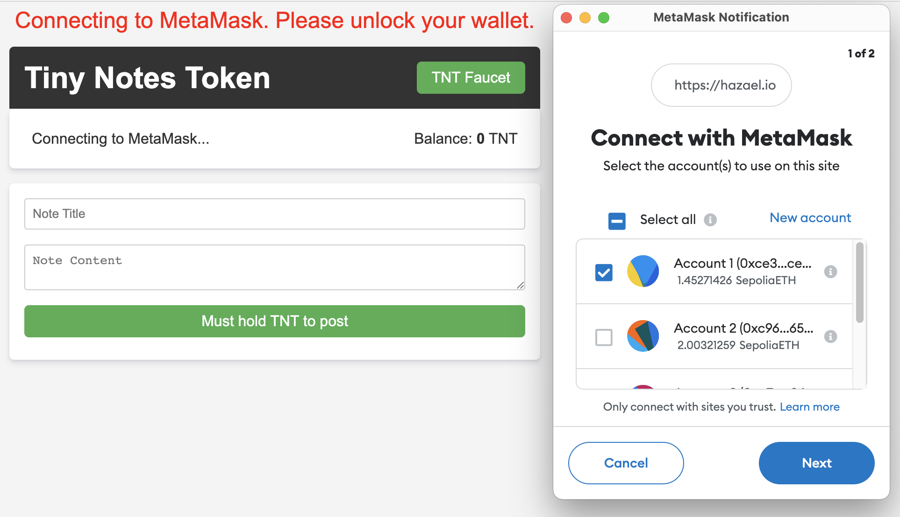
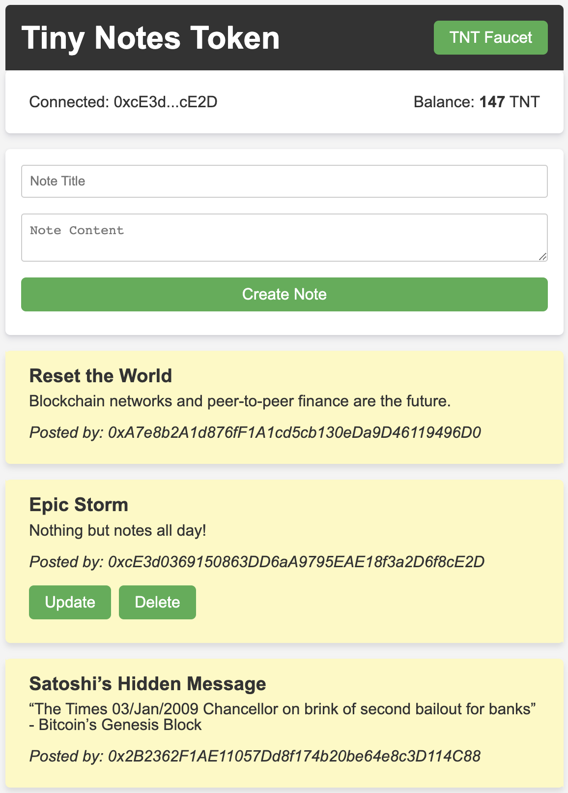

# `Tiny Notes Token (TNT)`

Tiny Notes Token (TNT) is a decentralized application (dApp) that allows users to create, update, and delete notes on the Ethereum blockchain. To post notes with the dApp, users must hold TNT tokens. A faucet is available for users to request tokens if they hold a balance of zero.

## Features

- Create, read, update, and delete notes
- Token faucet for requesting TNT tokens
- Balance display
- MetaMask integration

## Smart Contracts

The project includes two smart contracts:

1.  `TinyNotesToken.sol` - The Tiny Notes Token (TNT) ERC20 contract.
2.  `TinyNotesTokenFaucet.sol` - The faucet contract for distributing TNT tokens.

### Tiny Notes Token (TNT)

The Tiny Notes Token (TNT) is an ERC20 token with additional functionality for creating, updating, and deleting notes. The contract has the following key methods:

- `createNote(string memory _title, string memory _content)` - Creates a new note with the specified title and content.

- `readNote(uint256 _noteId)` - Fetches the details of a specific note by its ID.
- `updateNote(uint256 _noteId, string memory _newTitle, string memory _newContent)` - Updates an existing note with the specified note ID, new title, and new content.
- `deleteNote(uint256 _noteId)` - Deletes a note with the specified note ID.

### Tiny Notes Token Faucet

The Tiny Notes Token Faucet is a simple contract that allows users to request a fixed amount of TNT tokens. The contract has the following key methods:

- `requestTokens()` - Requests tokens from the faucet.

## Setup

### Requirements

- [Remix](https://remix.ethereum.org/) IDE for deploying the smart contracts.
- [MetaMask](https://metamask.io/) browser extension for interacting with the frontend.
- [http-server](https://www.npmjs.com/package/http-server) or any other HTTP server as well as live hosting with services like Github Pages, for a worldwide publically accesible dApp.

### Installation

1.  Fork or clone the repository.

2.  Compile and Deploy both smart contracts via Remix or method of choice, starting with the Token contract.
3.  Update the `.json` files in the `abis` folder with the `ABIs of the newly deployed contracts`.
4.  Update the `defaultChainId` variable in `app.js` if contracts were deployed to a network other than `Sepolia`.
5.  Update the `tokenAddress` and `faucetAddress` variables in `app.js` with the deployed contract addresses.
6.  Run the `HTTP server` `docs` directory or push to Github to automatically deploy to Github Pages in order to interact with the dApp.

## Usage

1.  Connect your MetaMask to the appropriate test network (e.g., Sepolia).
2.  Unlock your MetaMask wallet.
3.  Request TNT tokens from the faucet by clicking on the "TNT Faucet" button.
4.  Check your TNT balance.
5.  Create, update, and delete notes using the provided form and buttons.

## Screenshots

### Metamask Connecting

  

### TNT Loaded

  

## License

This project is UNLICENSED.
